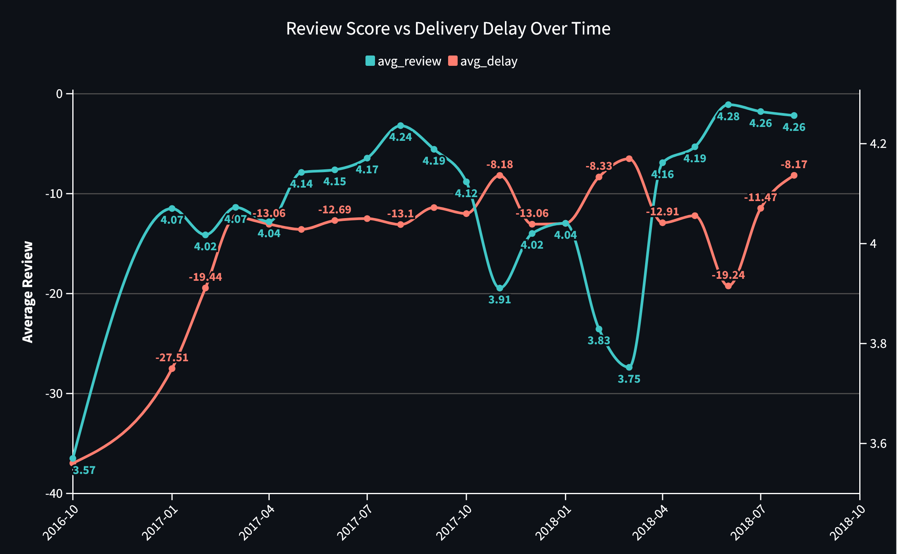
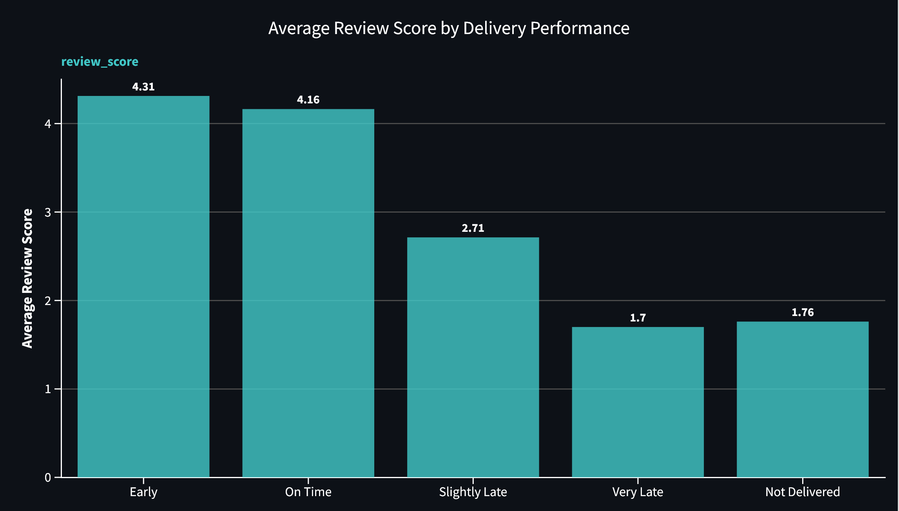
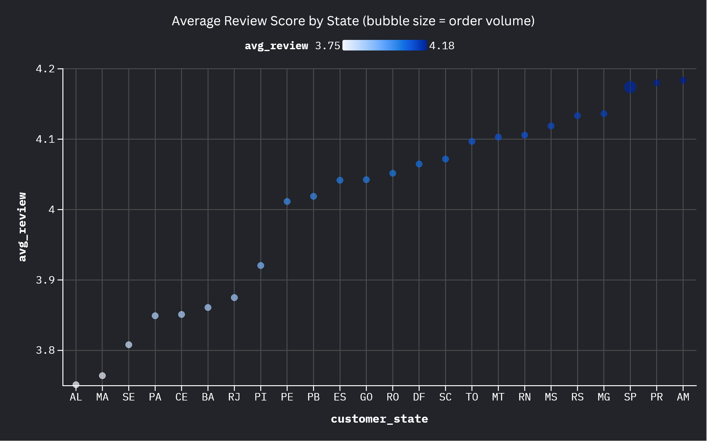

# 📦 Delivery Performance vs. Customer Satisfaction Olist E-Commerce

## ❓ The Problem

Does delivery performance actually affect customer satisfaction, or are buyers willing to forgive a late package? More importantly, exactly how much money and reputation are lost when "estimated delivery" turns into a distant promise?

## 🗂️ The Data

- Source: Olist Brazilian E-Commerce Dataset (Kaggle)
- Size: 99,224 orders, built by joining the orders, reviews, and customers tables via SQL
- Time span: October 2016 - August 2018 (~22 months)
- Key columns: order_purchase_timestamp, order_delivered_customer_date, order_estimated_delivery_date, review_score, customer_state

## 🧹 Data Quality Checks

- Duplicates: none found
- Missing values: 2,865 orders (2.9%) had no delivery date logged. Rather than dropping these, they were categorized separately as "Not Delivered" since that's a distinct and meaningful outcome, not a data error.
- Outliers: checked extreme delivery delays (up to 188 days late, 147 days early). Inspected these individually and confirmed they were legitimate orders, not data entry errors, so they were kept in the analysis.

## 🛠️ Approach

Used Python (pandas, SQLite, scipy, matplotlib) in Jupyter. Loaded orders, reviews, and customers tables into a local SQLite database and joined them with SQL. Calculated delivery delay (actual delivery date minus estimated delivery date) and grouped it into five categories: Early, On Time, Slightly Late, Very Late, and Not Delivered. Tested the relationship between delay category and review score with a one-way ANOVA, then checked whether the pattern held at the state level and over time.

## 📊 Findings

- There is a strong, statistically significant relationship between delivery performance and review score (ANOVA: F = 6347.49, p < 0.001). Average review score drops steadily from 4.31 (Early) to 4.16 (On Time) to 2.71 (Slightly Late) to 1.70 (Very Late).
- Orders that were never delivered score slightly lower on average (1.76) than "Very Late" orders (1.70) essentially the same low level of satisfaction, with no meaningful difference between the two.
- 9.3% of all orders (9,275 of 99,224) fall into Slightly Late, Very Late, or Not Delivered. This relatively small share of orders accounts for most of the platform's low review scores.
- The pattern holds at the state level. Rio de Janeiro (RJ) stands out as a priority case: it's the platform's 2nd-highest volume state (12,765 orders) but sits below the median review score (3.87), making it the single highest-leverage geography to investigate.
- The relationship also appears at the monthly level, but more weakly (correlation = 0.35) than the per-order relationship. This is expected aggregating thousands of orders into monthly averages smooths out the individual-order effect and mixes in unrelated monthly factors. For example, November 2017's order volume spike (consistent with Brazil's Black Friday period) coincides with a review-score dip not fully explained by delivery delay alone.

****

## 💡 Recommendation

Delivery reliability is a direct, measurable driver of customer satisfaction. The 9.3% of orders with poor delivery outcomes represent the highest-leverage group to target rather than broad delivery-speed improvements across all orders, investigating carrier and logistics performance specifically in high-volume, underperforming states like Rio de Janeiro would likely have the largest impact on average review scores and, by extension, repeat purchase behavior.

## ⚠️ Limitations

- This analysis is correlational, not causal. A late delivery may correlate with other unmeasured problems (e.g. damaged goods, wrong item shipped) that could also be driving the low score, independent of delay itself.
- The dataset spans ~22 months, long enough to observe some seasonal effects (e.g. the November 2017 volume spike), but not multiple full years, so longer-term seasonality can't be confirmed.
- Review score doesn't capture _why_ a customer was unhappy. The dataset includes review text, which wasn't analyzed here and could add useful context in a follow-up.

## 🔗 Explore the Project

- Codebase: [Jupyter Notebook via GitHub](olist_analysis.ipynb)
- Visuals: [Chart Overview](chart_overview)
